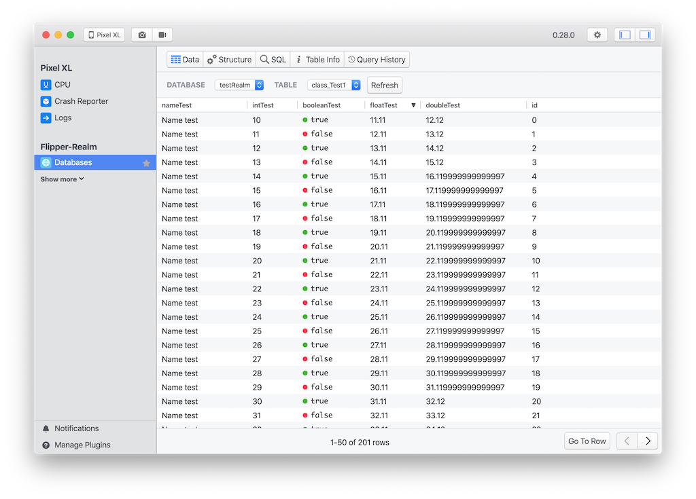

[  ](https://bintray.com/kamgurgul/flipper/flipper-realm-android/2.0.0/link)
[  ](https://bintray.com/kamgurgul/flipper/flipper-realm-android/1.0.0/link)

Android Realm driver for [Flipper](https://github.com/facebook/flipper).

Because of breaking changes between [Realm](https://github.com/realm/realm-java) versions driver is split into two versions:
* **2.+** for **Realm 7.+** and **Realm 10.+**
* **1.+** for **Realm 5.+** and **Realm 6.+**

Download
========
* Configure [Flipper](https://fbflipper.com/docs/getting-started.html)
* Top level gradle:
```kotlin
allprojects {
    repositories {
        ...
        jcenter()
    }
}
```
* Dependency:

Realm version >= 7:
```kotlin
implementation "com.kgurgul.flipper:flipper-realm-android:2.0.0"
```
Realm version < 7:
```kotlin
implementation "com.kgurgul.flipper:flipper-realm-android:1.0.0"
```
* Instantiate and add plugin to the FlipperClient. All your 
RealmConfigurations should be passed to RealmDatabaseProvider:
```kotlin
client.addPlugin(
    DatabasesFlipperPlugin(
        RealmDatabaseDriver(
            this,
            object : RealmDatabaseProvider {
                override fun getRealmConfigurations(): List<RealmConfiguration> {
                    return listOf(yourRealmConfiguration)
            }
        })
    )
)
```

Usage
=====
Open Flipper app and enable Database plugin



Features
========
* Displaying data from Realm database
* Displaying database structure

Currently it is not possible to sort data by columns or modify database from Flipper.

License
-------
    Copyright 2019 KG Soft

    Licensed under the Apache License, Version 2.0 (the "License");
    you may not use this file except in compliance with the License.
    You may obtain a copy of the License at

       http://www.apache.org/licenses/LICENSE-2.0

    Unless required by applicable law or agreed to in writing, software
    distributed under the License is distributed on an "AS IS" BASIS,
    WITHOUT WARRANTIES OR CONDITIONS OF ANY KIND, either express or implied.
    See the License for the specific language governing permissions and
    limitations under the License.
